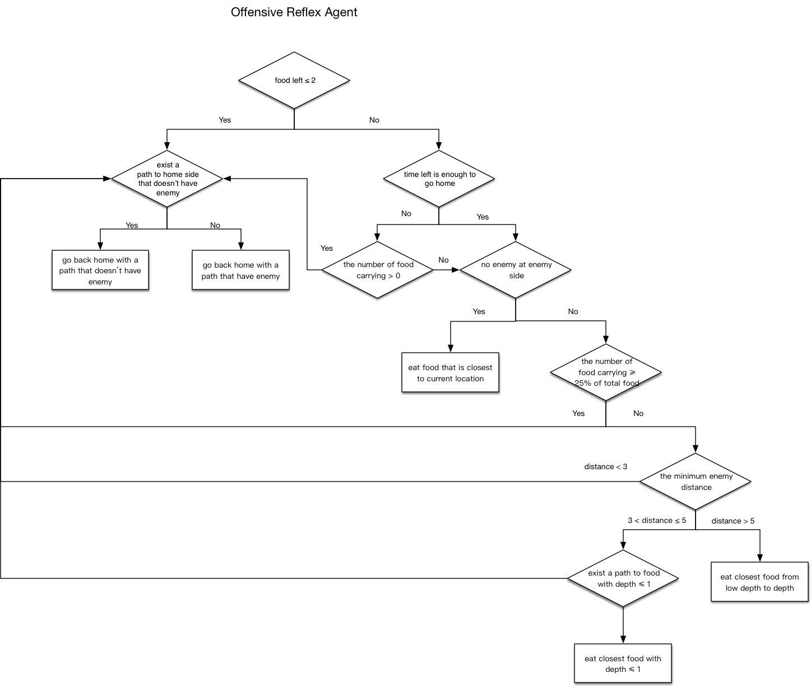

# Introduction
This project implements a Pac Man Autonomous Agent that can play and compete in a tournament. The rules are http://ai.berkeley.edu/contest.html.

# Game Strategy

There are two important concepts related to our strategy: depth of food and enemy tracking.

## Food Depth
The choice of target food is significant in the algorithm. The strategy we used is calculating the depth from the food to the corresponding exit. The paragraphs below will explain the algorithm of how exits are located.

- Nearest Exit

The exit is defined as a point surrounding 1 or 0 wall. Thus, we can use the Depth First Search to find this point from the food. However, when the food is located at a dead end with 2 or more width, this algorithm will fail to locate the right exit.

- Food Depth

The food depth is referred by the number of steps from the food to the nearest exit.

## Enemy Tracking
As mentioned in the project specification, enemies can be only seen within 5 units distance, calculated by Manhattan Distance. Therefore, an algorithm of predicting enemy's position is needed. The algorithm can be separated into following parts and we will discuss those details specifically.

- Enemy Out Of Sight

Because the noise distance between agents can be obtained by using `gameState.getAgentDistances()`, the location of enemy can be roughly calculated. Specifically, each movement of an enemy will change the distance, we used this feature to calculate the probability of points that the enemy would be located at. Therefore, a probability map of those points can be generated and the point with the largest probability will be chosen as the possible enemy location.

- Enemy In Sight

There are two circumstances that the enemy can be observed, which are

* the enemy is within 5 Manhattan distance
* the enemy has eaten a food

Either of these situation will trigger the algorithm to stop predicting the location of the enemy. Instead, the actual position will be updated.

- Update Time

In each of calculating time, the algorithm will update the probability map. Thus, the time of calculation would be increased slightly. The time depends on the number of enemies, which is fixed. Therefore, the cost calculation would not be affected significantly.

Only enemies that are is pacman but with maze distance less than 3, and enemies at enemy side and is not scared or with a scared timer less than 3 are considered as enemy for offensive reflex agent. 

## Game Strategy

In our final game strategy, there is always one offensive reflex agent and one defensive reflex agent.
The flow chart of offensive reflex agent and defensive reflex agent is shown below:

